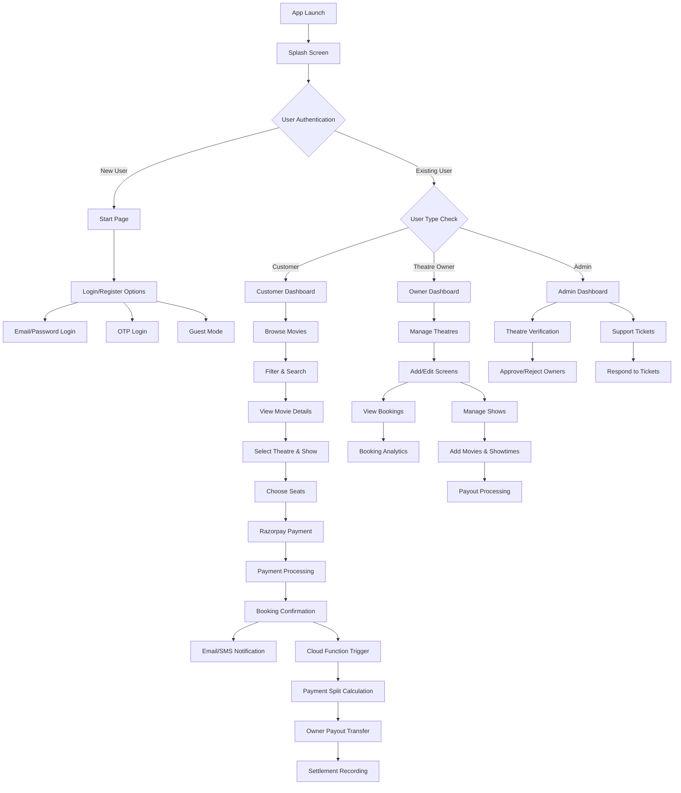
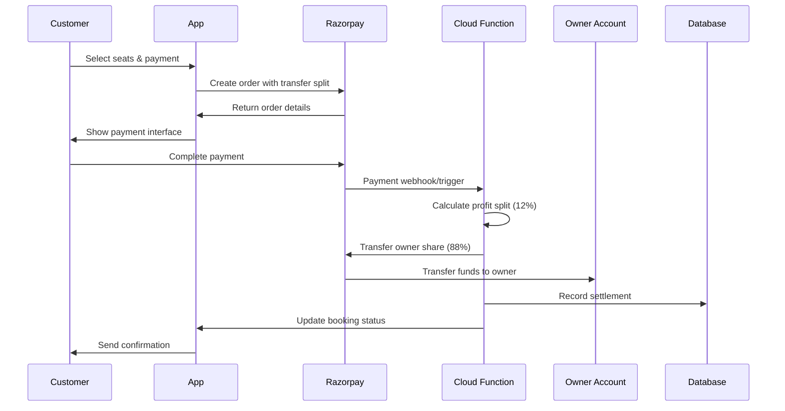
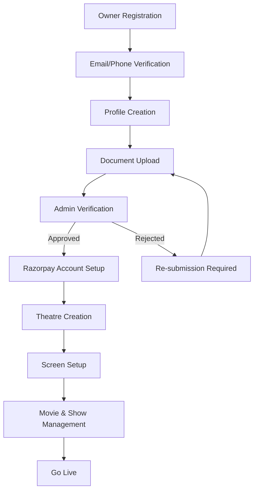
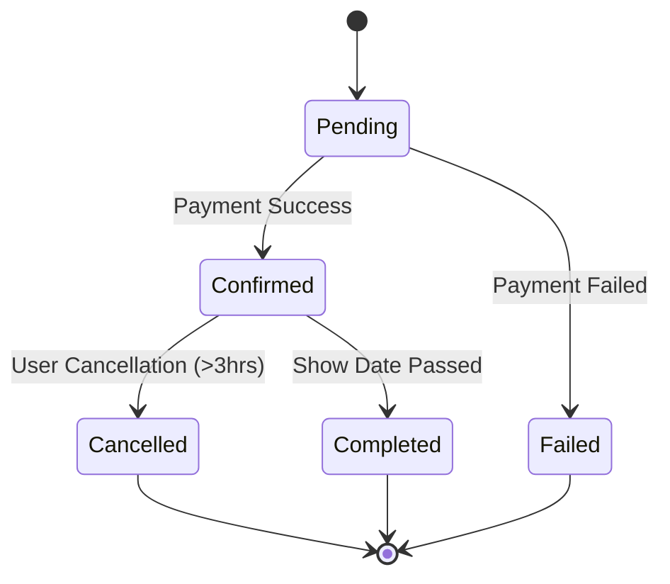

# BookMyBiz 🎬

<div align="center">
  
  
  **A Complete Movie Theatre Booking Management System**
  
  [](https://play.google.com/store)
  [](https://flutter.dev)
  [](https://firebase.google.com)
  [](https://play.google.com/store)
</div>

---

## 🏢 Company Information

**Developed by:** [Punchbiz](https://punchbiz.com)  
**Lead Developer:** Mohamed Athik R (App Developer)  
**Current Version:** 1.0 (In Development)  
**Platform:** Flutter (Android & iOS)

---

## 📱 Application Overview

BookMyBiz is a comprehensive movie theatre booking management system that connects cinema owners with movie enthusiasts, providing a seamless platform for movie ticket reservations. The application supports multiple user roles, real-time seat booking management, integrated payment processing, and automated business operations.

---

## 🎯 System Architecture & Flow

### 📊 Application Flow Diagram



### 🔄 Complete System Flow

#### 1. **Application Initialization**
```
App Launch → Firebase Initialization → Authentication Check → Role-based Routing
```

#### 2. **User Registration Flow**
```
Start Page → Register → Email/Mobile Verification → OTP Verification → Profile Creation → Role Assignment
```

#### 3. **Booking Flow (Customer)**
```
Browse Movies → Apply Filters → Select Movie → View Details → Choose Theatre & Show → 
Select Seats → Process Payment → Booking Confirmation → 
Email/SMS Notification → Cloud Function Trigger → Payment Split
```

#### 4. **Theatre Management Flow (Owner)**
```
Owner Dashboard → Add Theatre → Upload Images → Add Screens → Define Seat Layout → 
Add Movies & Shows → Account Verification → Receive Bookings → Manage Shows → Receive Payouts
```

#### 5. **Admin Management Flow**
```
Admin Login → Theatre Verification → Document Review → Approve/Reject → 
Support Ticket Management → System Monitoring
```

---

## 👥 User Roles & Permissions

### 🔵 **Customer (User)**
- **Capabilities:**
  - Browse and search movies
  - Filter by location, genre, language, rating
  - View detailed movie information
  - Book movie tickets with seat selection
  - Make online payments via Razorpay
  - View booking history
  - Cancel bookings (3+ hours in advance)
  - Raise support tickets
  - Manage profile

### 🟢 **Theatre Owner**
- **Capabilities:**
  - Add and manage multiple theatres
  - Upload theatre images with spotlight image
  - Add multiple screens with custom seat layouts
  - Define seat categories and pricing
  - Add movies and manage showtimes
  - View real-time booking analytics
  - Manage booking requests
  - Receive automated payouts (88% of ticket price)
  - Track settlement history
  - Update theatre status (Open/Closed)

### 🔴 **Admin**
- **Capabilities:**
  - Verify theatre owner documents (Aadhaar, PAN, GST)
  - Approve/reject owner registrations
  - Manage support ticket system
  - Monitor platform transactions
  - Access user management tools
  - System-wide oversight

---

## 🏗️ Database Schema

### 📋 **Firestore Collections Structure**

#### **Users Collection**
```javascript
users/{userId} {
  uid: string,
  name: string,
  email: string,
  mobile: string,
  userType: "User" | "Theatre Owner" | "adminuser",
  status: "yes" | "Not Confirmed" | "Disagree",
  imageUrl?: string,
  razorpayAccountId?: string, // For theatre owners
  createdAt: timestamp,
  verifiedby?: {
    id: string,
    name: string,
    mobile: string
  }
}
```

#### **Movie Theatres Collection**
```javascript
movie_theatres/{theatreId} {
  theatreId: string,
  name: string,
  description: string,
  imageUrl: string, // Spotlight image
  theatreImages: string[], // Additional images
  facilities: string[],
  ownerId: string,
  location: string,
  latitude?: number,
  longitude?: number,
  status: "Open" | "Closed",
  theatre_status: "Verified" | "Not Verified" | "Disapproved",
  hasLocation: boolean,
  createdAt: timestamp
}
```

#### **Movie Screens Collection**
```javascript
movie_screens/{screenId} {
  screenId: string,
  theatreId: string,
  screenName: string,
  totalSeats: number,
  rows: number,
  seatsPerRow: number,
  seatLayout: {
    [rowLetter]: {
      [seatNumber]: {
        category: "Regular" | "Premium" | "VIP",
        price: number,
        available: boolean
      }
    }
  },
  screenType: "2D" | "3D" | "IMAX" | "4DX",
  createdAt: timestamp
}
```

#### **Movies Collection**
```javascript
movies/{movieId} {
  movieId: string,
  title: string,
  description: string,
  genre: string[],
  language: string[],
  duration: number, // in minutes
  rating: string, // U, UA, A
  releaseDate: string,
  posterUrl: string,
  trailerUrl?: string,
  cast: string[],
  director: string,
  status: "Now Showing" | "Coming Soon" | "Ended"
}
```

#### **Movie Shows Collection**
```javascript
movie_shows/{showId} {
  showId: string,
  movieId: string,
  theatreId: string,
  screenId: string,
  showDate: string, // YYYY-MM-DD
  showTime: string, // HH:MM
  endTime: string, // HH:MM
  availableSeats: number,
  bookedSeats: string[], // ["A1", "A2", "B5"]
  pricing: {
    Regular: number,
    Premium: number,
    VIP: number
  },
  createdAt: timestamp
}
```

#### **Movie Bookings Collection**
```javascript
movie_bookings/{bookingId} {
  userId: string,
  userName: string,
  movieId: string,
  movieTitle: string,
  theatreId: string,
  theatreName: string,
  screenId: string,
  screenName: string,
  showId: string,
  showDate: string,
  showTime: string,
  selectedSeats: string[], // ["A1", "A2"]
  seatCategories: string[], // ["Regular", "Premium"]
  totalAmount: number,
  platformFee: number, // 12% commission (hidden from user)
  actualTicketPrice: number,
  paymentMethod: "Online",
  status: "confirmed" | "pending" | "cancelled",
  razorpayPaymentId?: string,
  razorpayOrderId?: string,
  payoutStatus?: "pending" | "settled" | "failed",
  createdAt: timestamp,
  canCancel: boolean // true if >3 hours before show
}
```

#### **Theatre Bookings Sub-collection**
```javascript
movie_theatres/{theatreId}/bookings/{bookingId} {
  // Same structure as main movie_bookings collection
  // Used for theatre-specific booking queries
}
```

#### **Documents Collection** (Owner Verification)
```javascript
documents/{userId} {
  userId: string,
  aadhar: string, // Base64 encoded
  pan: string, // Base64 encoded
  gst?: string // Optional GST number
}
```

#### **Support Tickets Collection**
```javascript
support_tickets/{ticketId} {
  userId: string,
  userEmail: string,
  subject: string,
  message: string,
  status: "open" | "Closed",
  adminResponse?: string,
  createdAt: timestamp,
  respondedAt?: timestamp
}
```

#### **Settlement Tracking Collections**
```javascript
movie_booking_settlements/{bookingId} {
  booking_id: string,
  theatre_id: string,
  total_paid: number,
  owner_share: number, // 88% of ticket price
  platform_profit: number, // 12% commission
  razorpay_payment_id: string,
  owner_account_id: string,
  settledAt: timestamp
}

movie_razorpay_orders/{orderId} {
  booking_id: string,
  theatre_id: string,
  total_paid: number,
  owner_share: number,
  platform_profit: number,
  razorpay_order_id: string,
  owner_account_id: string,
  createdAt: timestamp
}
```

---

## 💳 Payment System Architecture

### 🔄 **Payment Flow Diagram**



### 💰 **Payment Split Logic**

The application implements a fixed commission structure:

#### **Commission Structure:**
- **Platform Commission:** 12% of total ticket price
- **Theatre Owner Share:** 88% of total ticket price

#### **Fee Structure:**
- **Razorpay Fee:** 2% + 18% GST = 2.36%
- **Total Charge Formula:** `ticketPrice * 1.12` (includes 12% platform fee)
- **Owner Receives:** 88% of displayed ticket price
- **Platform Keeps:** 12% commission + Razorpay fees

#### **Example Calculation:**
```javascript
// For ₹200 base ticket price:
Platform Commission = ₹24 (12%)
Displayed Price = ₹224 (₹200 + ₹24)
Razorpay Fee = ₹5.29 (2.36% of ₹224)
Owner Receives = ₹200 (base price)
Platform Keeps = ₹29.29 (₹24 commission + ₹5.29 fees)
```

---

## 🎬 Core Functionalities

### 🏠 **Customer Features**

#### **Movie Discovery & Booking**
- **Advanced Search & Filtering:**
  - Location-based filtering
  - Genre and language filtering
  - Rating and release date filtering
  - Real-time show availability

- **Seat Selection:**
  - Interactive seat map
  - Category-wise pricing (Regular/Premium/VIP)
  - Real-time seat availability
  - Multiple seat selection

- **Booking Management:**
  - Show time selection
  - Seat category selection
  - Automatic conflict detection
  - 3-hour cancellation policy

#### **Payment & Tickets**
- **Secure Payments:**
  - Razorpay integration (UPI, Cards, Net Banking)
  - Automatic receipt generation
  - Digital ticket with QR code

#### **Booking History & Management**
- **Categorized View:**
  - Upcoming shows
  - Past bookings
  - Cancelled bookings

- **Cancellation Policy:**
  - 3+ hours advance cancellation
  - Automatic refund processing
  - No refund for late cancellations

### 🏢 **Theatre Owner Features**

#### **Theatre Management**
- **Multi-Theatre Support:**
  - Add unlimited theatres
  - Image gallery with spotlight image
  - Drag-and-drop image reordering
  - Theatre facility management

#### **Screen Management**
- **Custom Screen Setup:**
  - Add multiple screens per theatre
  - Define seat layout (rows and seats per row)
  - Set seat categories and pricing
  - Screen type configuration (2D/3D/IMAX/4DX)

#### **Movie & Show Management**
- **Show Scheduling:**
  - Add current movies
  - Create multiple shows per day
  - Set show timings
  - Manage seat availability

#### **Business Analytics**
- **Revenue Tracking:**
  - Booking statistics
  - Revenue per show/movie
  - Occupancy rates
  - Customer insights

#### **Financial Management**
- **Automated Payouts:**
  - Razorpay Route integration
  - 88% revenue share
  - Real-time settlement tracking
  - Settlement history

### 👨‍💼 **Admin Features**

#### **Theatre Verification System**
- **Document Verification:**
  - Aadhaar card verification
  - PAN card verification
  - GST number validation (optional)
  - Razorpay account ID validation

#### **Approval Workflow**
- **Theatre Management:**
  - Review theatre applications
  - Approve/reject registrations
  - Verification tracking
  - Automated notifications

#### **Support Management**
- **Ticket System:**
  - Real-time ticket monitoring
  - Email response integration
  - Ticket status tracking
  - Automated acknowledgments

---

## 🎫 Movie Booking Features

### 🎬 **Movie Management**
- **Movie Database:**
  - Comprehensive movie information
  - Poster and trailer integration
  - Cast and crew details
  - Genre and language categorization

### 🎭 **Show Management**
- **Flexible Scheduling:**
  - Multiple shows per day
  - Different pricing for different times
  - Weekend and holiday pricing
  - Special screening management

### 💺 **Seat Management**
- **Interactive Seat Selection:**
  - Visual seat map like BookMyShow
  - Row-wise organization (A, B, C...)
  - Seat numbering (1, 2, 3...)
  - Category-based pricing
  - Real-time availability updates

### 🎟️ **Ticket Features**
- **Digital Tickets:**
  - QR code for entry
  - Booking details
  - Theatre information
  - Show timings

---

## 📧 Email Notification System

### 📬 **Automated Email Services**

#### **Booking Confirmations:**
- Sent via external email service
- Contains booking details, movie information
- Includes cancellation policy
- QR code for easy access

#### **Support Acknowledgments:**
- Immediate auto-response
- Ticket reference number
- Expected response timeline
- Contact information

#### **Email Service Integration:**
```javascript
// External service endpoint
POST https://cloud-functions-vnxv.onrender.com/sendSupportAck
{
  "email": "user@example.com",
  "subject": "Support Request",
  "message": "Response content"
}
```

---

## 🔔 Notification System

### 📱 **Multi-Channel Notifications**

#### **In-App Notifications:**
- Real-time booking updates
- Payment confirmations
- Show reminders
- New movie releases

#### **Email Notifications:**
- Booking confirmations
- Payment receipts
- Support responses
- Account verification updates

#### **SMS Notifications:**
- OTP delivery
- Booking confirmations
- Show reminders
- Emergency alerts

---

## 🔒 Security Implementation

### 🛡️ **Firestore Security Rules**

```javascript
rules_version = '2';
service cloud.firestore {
  match /databases/{database}/documents {
    // User documents - users can only access their own data
    match /users/{userId} {
      allow read, write: if request.auth != null && request.auth.uid == userId;
    }
    
    // Theatres - open read, authenticated write
    match /movie_theatres/{theatreId} {
      allow read: if true;
      allow write: if request.auth != null;
    }
    
    // Movie bookings - users can only access their own bookings
    match /movie_bookings/{bookingId} {
      allow read, write: if request.auth != null && 
        request.auth.uid == resource.data.userId;
    }
    
    // Movies - open read for all users
    match /movies/{movieId} {
      allow read: if true;
      allow write: if request.auth != null;
    }
    
    // Movie shows - open read, owner write
    match /movie_shows/{showId} {
      allow read: if true;
      allow write: if request.auth != null;
    }
  }
}
```

---

## 📊 Business Logic & Workflows

### 🏪 **Theatre Owner Onboarding**



### 📅 **Booking Lifecycle Management**



---

## 🎯 **Key Features**

### 🔍 **Advanced Movie Discovery**
- **Smart Search & Filtering**
- **Genre-based browsing**
- **Language preferences**
- **Rating-based filtering**
- **Location-based theatre search**

### 📱 **BookMyShow-like Experience**
- **Intuitive seat selection**
- **Real-time seat availability**
- **Category-wise pricing display**
- **Smooth animations and transitions**
- **Responsive design for all screen sizes**

### 🔄 **Real-time Synchronization**
- **Live seat availability updates**
- **Instant payment confirmations**
- **Real-time show updates**
- **Push notifications**
- **Automatic data synchronization**

---

## 🚀 **Technical Implementation**

### 🏗️ **Architecture Patterns**

#### **Frontend (Flutter)**
- **State Management:** StatefulWidget with setState
- **Navigation:** MaterialPageRoute with named routes
- **UI Framework:** Material Design 3
- **Image Handling:** Firebase Storage integration
- **Local Storage:** SharedPreferences for credentials

#### **Backend (Firebase)**
- **Authentication:** Firebase Auth with multi-provider
- **Database:** Cloud Firestore with real-time listeners
- **Storage:** Firebase Storage for media assets
- **Functions:** Node.js Cloud Functions for business logic

#### **Payment Integration**
- **Gateway:** Razorpay with Route transfers
- **Commission:** Fixed 12% platform fee
- **Security:** Server-side validation
- **Settlement:** Automated split transfers (88% to owner)

---

## 🎬 **Movie Booking Workflow**

### 🎭 **Customer Journey**
1. **Browse Movies:** View current and upcoming movies
2. **Select Movie:** Choose preferred movie
3. **Choose Theatre:** Select nearby theatre
4. **Pick Show:** Select convenient show time
5. **Select Seats:** Interactive seat selection
6. **Payment:** Secure Razorpay payment
7. **Confirmation:** Digital ticket with QR code

### 🏢 **Theatre Owner Journey**
1. **Theatre Setup:** Add theatre with details
2. **Screen Configuration:** Define screens with seat layouts
3. **Movie Management:** Add current movies
4. **Show Scheduling:** Create show timings
5. **Revenue Tracking:** Monitor bookings and earnings

---

## 📞 **Support Channels**

### 📧 **Support Email Configuration**
- **Customer Support:** `customersbmb@gmail.com`
- **Owner Support:** `ownersbmb@gmail.com`
- **Admin Access:** `adminpunchbiz@gmail.com`

### 📱 **Contact Information**
- **Technical Support:** Available through in-app tickets
- **Business Inquiries:** Contact via support emails
- **Emergency Issues:** Priority support for critical problems

---

## 🔮 **Future Roadmap**

### 🎯 **Planned Features**
- **Food & beverage ordering**
- **Loyalty program integration**
- **Social features and reviews**
- **AI-powered movie recommendations**
- **Multi-language support**

### 🌟 **Enhancement Areas**
- **Performance optimizations**
- **Advanced analytics dashboard**
- **Enhanced security features**
- **Expanded geographical coverage**
- **Integration with movie databases**

---

## 📄 **License & Legal**

### ⚖️ **Terms of Service**
- Comprehensive terms for all user types
- Clear privacy policy
- Data protection compliance
- Dispute resolution procedures

### 🔒 **Data Privacy**
- GDPR compliance measures
- Secure data encryption
- User consent management
- Data retention policies

---

## 🤝 **Contributing**

### 👨‍💻 **Development Team**
- **Lead Developer:** Mohamed Athik R
- **Company:** Punchbiz
- **Contact:** Available through official channels

### 📋 **Development Standards**
- Follow Flutter best practices
- Maintain code documentation
- Implement comprehensive testing
- Ensure security compliance

---

## 📞 **Contact Information**

### 🏢 **Punchbiz**
- **Website:** [punchbiz.co](https://punchbiz.co)
- **Developer:** Mohamed Athik R
- **Support:** Available through app support system

### 📧 **Support Channels**
- **Customer Support:** `customersbmb@gmail.com`
- **Owner Support:** `ownersbmb@gmail.com`
- **Admin Portal:** `adminpunchbiz@gmail.com`

---

<div align="center">
  
  **BookMyBiz - Revolutionizing Movie Ticket Booking**
  
  [](https://play.google.com/store)
  
</div>